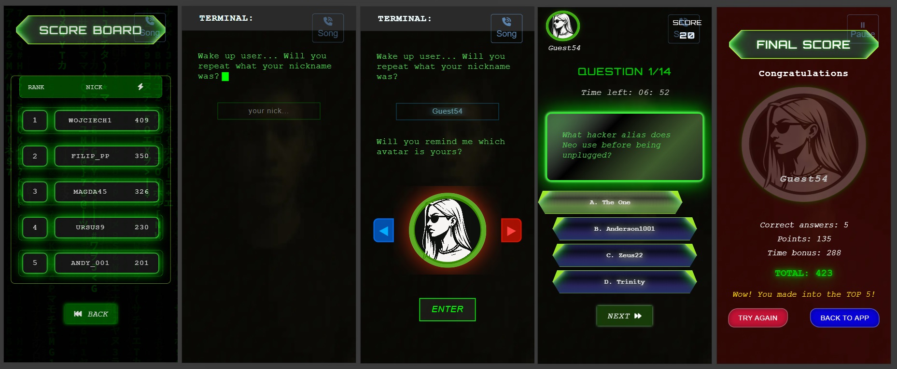

# Interactive-Matrix-Quiz
Demo - live version available at:
[**Interactive Matrix Quiz – GitHub Pages Demo**](https://wojciechsadowskinwd.github.io/Interactive-Matrix-Quiz/)

A single-page web application (SPA), inspired by the Matrix movie series.
The project was designed and implemented with both mobile devices and large screens in mind – fully responsive, in line with RWD principles.
The goals of the application were:
-	creating a quiz with immersion and interaction effects,
-	using modern animation techniques (Framer Motion library, smooth transitions, canvas background),
-	integrating the quiz with external data sources (REST API, Firebase),
-	implementing TypeScript and state management mechanisms (Reducer, async/await).

The project follows the concept of a fullscreen interface – all content fits 100% of the window’s height and width, eliminating the need for scrolling.


### Functionalities
-	Welcome screen with graphics, followed by a “Matrix Rain” animation (canvas + Framer Motion).
-	Movie collection fetched from a REST API, containing filtered titles from the Matrix series. [**API - The Movie Database**](https://api.themoviedb.org)
-	Interactive quiz with questions retrieved from Firebase (NoSQL).
-	Dynamic animations when switching between questions and screens.
-	Firebase integration – including retrieving and saving user scores.
-	Fullscreen mode – no scrolling, the entire interface adapts to the current browser dimensions.
-	RWD – works seamlessly on both mobile devices and large monitors.
-	TypeScript – static typing and code safety.

### Technology stack
-	React + TypeScript
-	Framer Motion – animations and transition effects
-	Redux – global state management (prepared for further extension)
-	HTML5 Canvas – background animation (falling code effect as in The Matrix)
-	REST API – fetching movie data related to the quiz theme
-	Firebase – database and score handling
-	CSS / SCSS – styling with responsive design in mind (RWD)

## Technologies and Solutions Used in the Project
This project was built with a modern React/TypeScript stack.  
Below is an overview of the libraries, React hooks, custom hooks, TypeScript features, and SCSS techniques applied in the codebase.  
The list highlights both the tools used and the specific language/React features I worked with, so you can quickly see the scope of technologies applied in practice.

### Libraries
-	**react-redux** – state management
-	**react-router-dom** – routing
-	**framer-motion** – smooth, interactive animations
-	**firebase/app** – the main Firebase SDK module, used to initialize the application and provide access to other Firebase services
-	**firebase/firestore** – Cloud Firestore support, a NoSQL cloud database enabling real-time data storage and retrieval

#### Core React
- **useState** – Stores and updates local component state  
- **useEffect** – Handles side effects (e.g. data fetching, subscriptions, DOM updates) after rendering  
- **useMemo** – Memoizes computed values to avoid redundant recalculations  
- **useRef** – Persists mutable values across renders (e.g. DOM element references)  

#### React Router
- **useLocation** – Provides information about the current route (path, query params)  
- **useNavigate** – Enables programmatic navigation between routes  

#### React Redux
- **useDispatch** – Returns the `dispatch` function to send actions to the Redux store  
- **useSelector** – Selects data from the Redux store and subscribes to changes  

### TypeScript
- Basic types (`string`, `number`, `boolean`, `null`, `undefined`)  
- Type aliases, interfaces  
- Union types, generics (`<T>`)  
- Optional properties (`prop?: type`)  
- Type assertions (`as`)  
- Utility types (`ReturnType`, `typeof`, `extends`)  
- Typing React props & events (`ReactNode`, `HTMLInputElement`, `ComponentPropsWithoutRef`)  
- `CSSProperties` (typing for inline styles)  
- Redux Toolkit typing (`RootState`, `AppDispatch`, `PayloadAction`, `TypedUseSelectorHook`)  
- Import/export types

### SCSS (Sass)
- Variables (`$variable`)  
- Mixins (`@mixin ...`)  
- Module system (`@import`)  
- CSS Modules integration (`*.module.scss`)  

## Screenshots
### Mobile views



### Desktop views


## Installation

To run the project locally:
1. **Clone the repository**
   ```bash
    git clone https://github.com/WojciechSadowskiNwD/Interactive-Matrix-Quiz.git
    cd Interactive-Matrix-Quiz

2. Install dependencies
   ```bash
   npm install
   # or
   yarn install
   
  3. Start the development server
     ```bash
     npm start
* The app will be available at http://localhost:3000 by default.

4. Build for production:
   ```bash
   npm run build
  *	The optimized production files will be created in the build/ directory.

## Deployment (GitHub Pages)
This project is configured to run on GitHub Pages.

1. Ensure package.json contains the correct homepage field:
   ```bash
   "homepage": "https://WojciechSadowskiNwD.github.io/Interactive-Matrix-Quiz"

2. Build the project:
    ```bash
    npm run build

3. Deploy to GitHub Pages:
   ```bash
   npm run deploy
(This project uses the gh-pages package to automate deployment — it pushes the contents of the build/ folder to the gh-pages branch.)

4. Ensure basename is set in React Router for proper routing:
   ```jsx
   <BrowserRouter basename="/Interactive-Matrix-Quiz">
      <App />
    </BrowserRouter>

## 📄 License

This project is open source and licensed under the MIT License.  
You are free to use, modify, and distribute it under the terms of this license.
